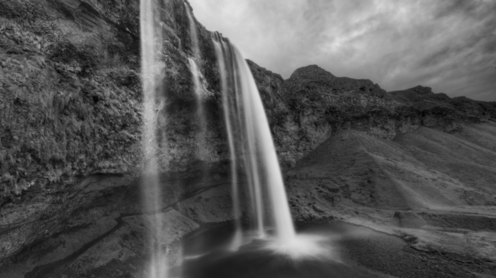

# CUDA implementation of Gaussian Filter
## Build & Run
```
mkdir build
cd build
cmake ..
make
./cuda_gauss 3840 2160 1 1 100 ../data/waterfall.png
```
## Example
- Original image

- Gaussian blurred image by CUDA


知乎：https://zhuanlan.zhihu.com/p/742166300
