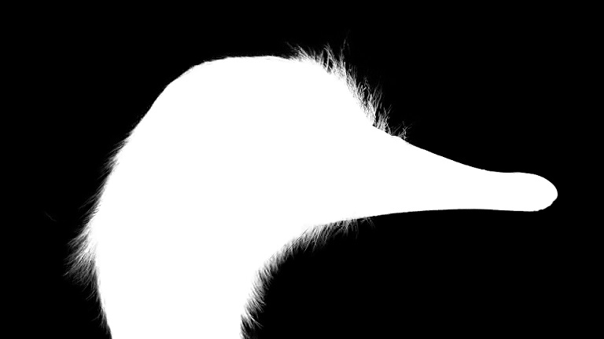
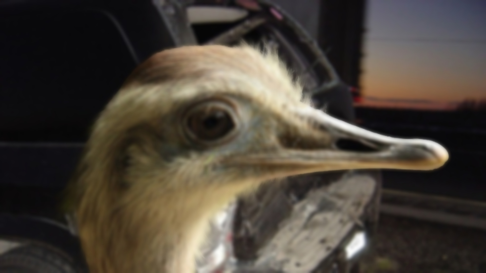
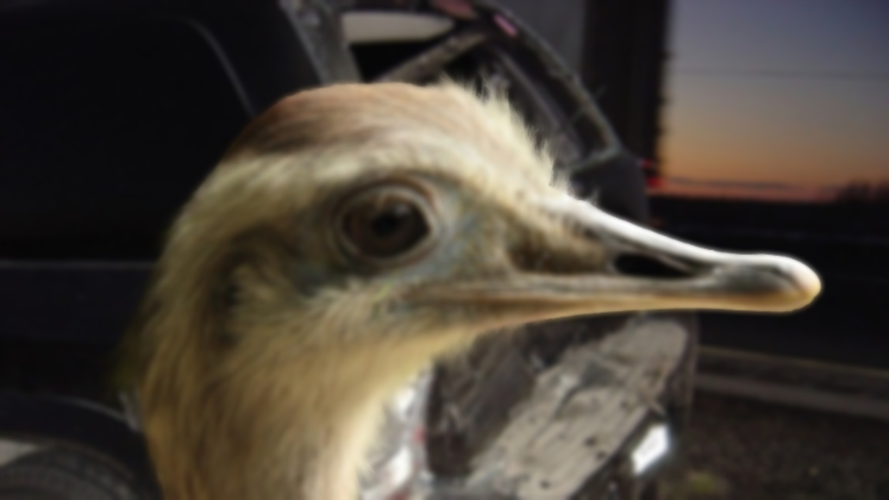

# CUDA implementation of guided filter.
## Build & Run
```
mkdir build
cd build
cmake..
make
./cuda_guided_filter
```
## Example
- Original image

- Guided image

- Guided filter by C++

- Guided filter by CUDA

