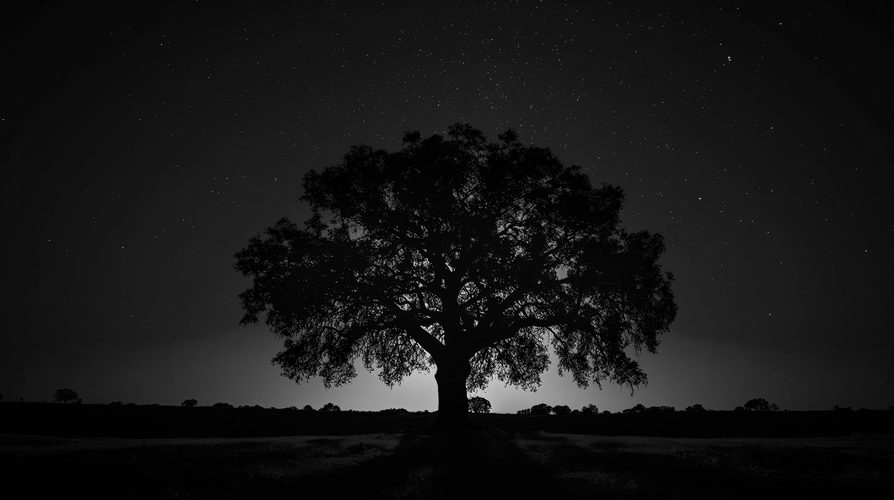
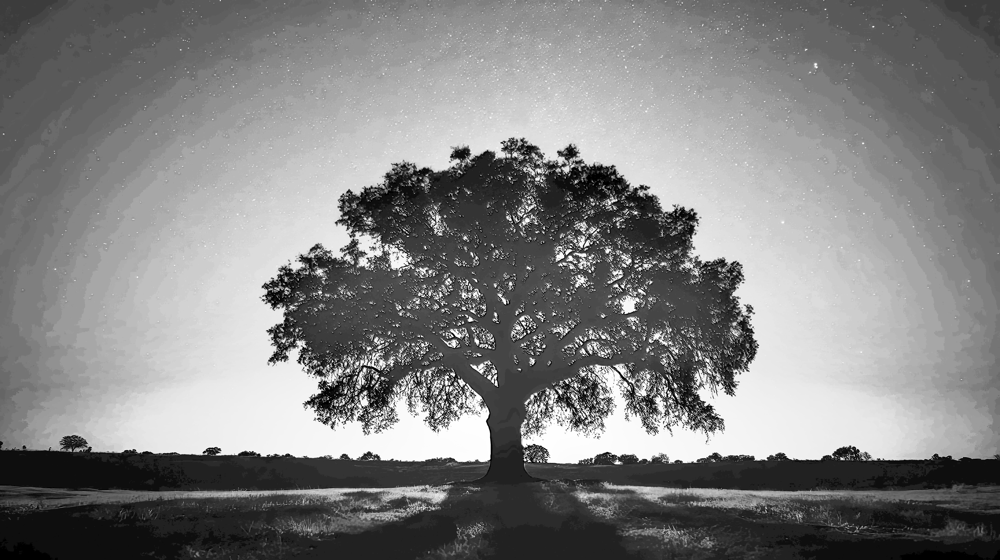

# CUDA implementation of histogram equalization and CLAHE.
## Build & Run
```
mkdir build
cd build
cmake ..
make
./cuda_histogram ../data/night.jpg 1 10 10
```
## Histogram Equalization Example
- Original image

- Histogram equalized by OpenCv

- Histogram equalized by CUDA

## CLAHE Example
- Original image

- Histogram equalized by OpenCv

- Histogram equalized by CUDA


知乎：https://zhuanlan.zhihu.com/p/742166300
